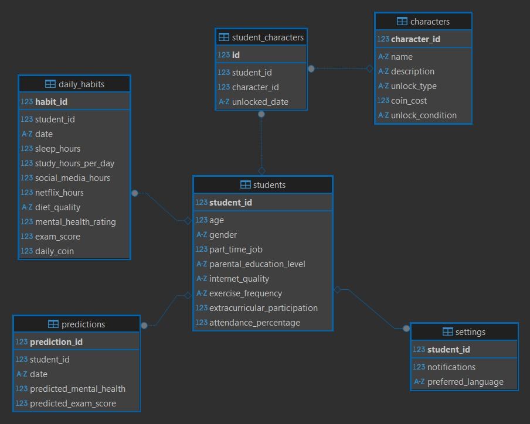

# YZTA-Bootcamp-Grup105

## Takım İsmi
Grup105

## Takım Üyeleri
- ***Mustafa yıldız*** - Scrum Master
- ***Oğuzhan sarıgöl*** - Product Owner
- ***Aslı aydın*** - Developer
- ***Kerem faruk öztürk*** - Developer
- ***Firdevs eyidoğan*** - Developer

## Uygulama İsmi

## Ürün Açıklaması
Öğrencilerin günlük alışkanlıklarını (uyku, çalışma, sosyal medya, spor vb.) analiz eden, yapay zeka ile sınav başarı tahmini ve kişiselleştirilmiş iyileştirme önerileri sunan web uygulaması.

##Ürün özelikleri 
- Günlük yemek alışkanlığı takibi 
- yeme alışkanlığı analiz edip öneri sunan bir model
- Çalışma takibi
- oyunlaştırma ile beraber  kulanıcı devamlılığı sağlama
- Çalışma önerileri sunma

## Hedef Kitle 
- YKS ye hazırlanan ve  kendi başına planlama yapamayan öğrenciler
- Disiplinli Ama İlerlemesini Göremeyen Öğrenci
- Danışanlarının verilerini daha iyi analiz edip destek vermek isteyen Rehber öğretmenler ve eğitim koçları

---
# **SPRINT 1**
 sprinti tamamlanması için beklenen değer 20 dir
 
**Puan tamamlama mantığı**: Proje boyunca tamamlanması gereken backlog puanı 100 dur. İlk Sprint için bitirilmesi istenilen puan sayısı 20 olarak belirlenmiştir.

**Daily scrum**: ağırlıklı olmak üzere  Whatsapp ve  Microsoft Teams üzerinden iletişime geçildi . yoğunluk ve farklı zamanlarda müsait olma durumu yüzünden haftada 2-3 toplantı yapıldı.

**Bazı iletişim mesajları ve toplantı görüntüleri**: https://imgur.com/a/IyXKAfT

## Screenshot:

**Burndown chart**

**Sprint Board Screenshot:**

**kanban template URL**
https://trello.com/invite/b/686297235b49ce8ca4b31e1e/ATTI3978c0d02684d8575d5e7ebb2ad97d8c4DCA6946/grup105

**Ürün ile ilgili bazı screenshotlar:**

## Sprint Review:

## Sprint Retrospective:
