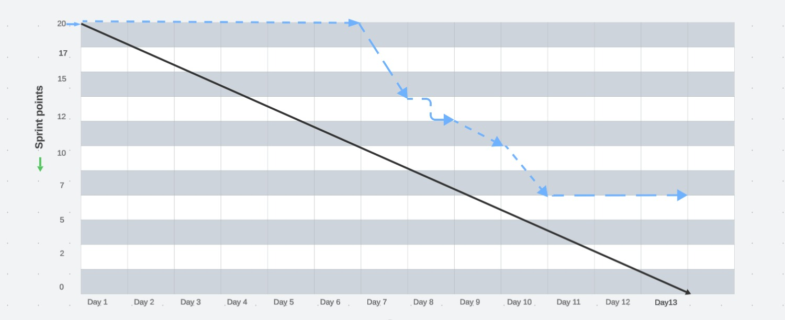
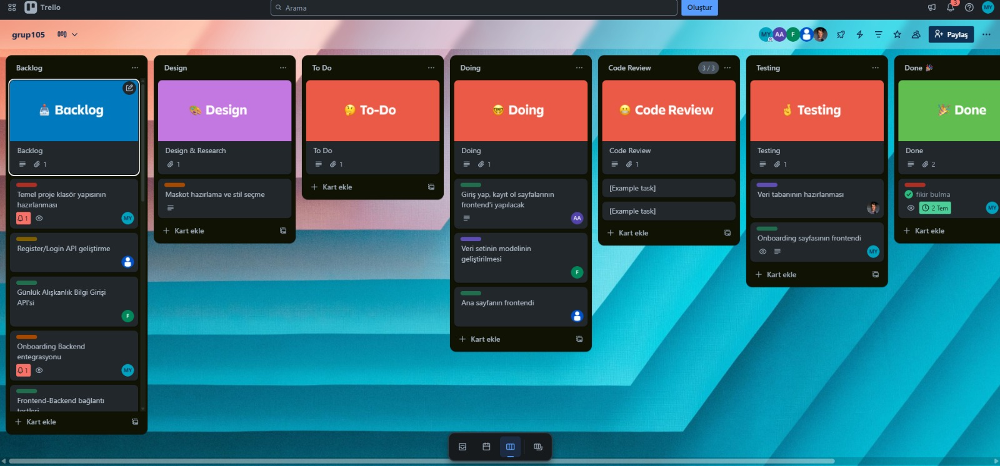
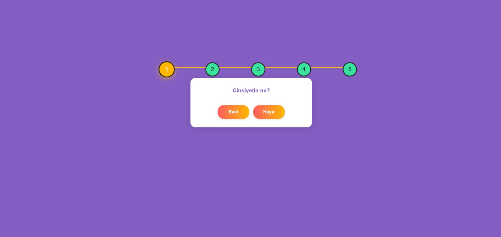
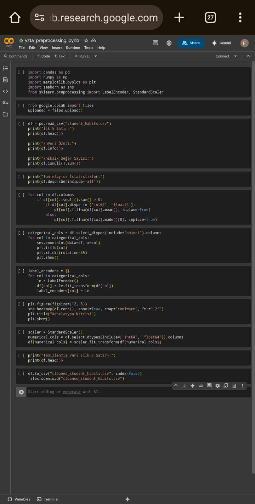

# YZTA-Bootcamp-Grup105

## Takım İsmi
Grup105

## Takım Üyeleri
- ***Mustafa YILDIZ*** - Scrum Master
- ***Oğuzhan SARIGÖL*** - Product Owner
- ***Aslı AYDIN*** - Developer
- ***Kerem Faruk ÖZTÜRK*** - Developer
- ***Firdevs EYİDOĞAN*** - Developer

## Uygulama İsmi
-Tilko

## Ürün Açıklaması
Öğrencilerin günlük alışkanlıklarını (uyku, çalışma, sosyal medya, spor vb.) analiz eden, yapay zeka ile sınav başarı tahmini ve kişiselleştirilmiş iyileştirme önerileri sunan web uygulaması.

##Ürün özelikleri 
- Günlük yemek alışkanlığı takibi 
- yeme alışkanlığı analiz edip öneri sunan bir model
- Çalışma takibi
- oyunlaştırma ile beraber  kulanıcı devamlılığı sağlama
- Çalışma önerileri sunma

## Hedef Kitle 
- YKS ye hazırlanan ve  kendi başına planlama yapamayan öğrenciler
- Disiplinli Ama İlerlemesini Göremeyen Öğrenci
- Danışanlarının verilerini daha iyi analiz edip destek vermek isteyen Rehber öğretmenler ve eğitim koçları

---
# **SPRINT 1**

**Sprint notları**
- yapılanlar:
 sprintin ilk haftası konu araştırması ve araştırma konularına dair  uygun data bulundu ve konu oyladı .
 webapp'in  frontend  bölümüne(giriş ekranı,kaydolma ekranı ,ana sayfa) başlandı.
 veriler tabanı hazırlandı ve  yeme alışkınlığı sınıflandıran model gelliştirilmrye başlandı  .

 - zorluk ve çözüm:
 geliştirilen yeme alışkanlığı sınıflandırma modelini kulanabilmek için paketlenmiş bir modeli  webapp de kulanma yollarını araştırmaya başlandı .
 

 
 sprinti tamamlanması için beklenen değer 20 dir
 
**Puan tamamlama mantığı**: Proje boyunca tamamlanması gereken backlog puanı 100 dur. İlk Sprint için bitirilmesi istenilen puan sayısı 20 olarak belirlenmiştir.ama 13 puan tamamlanabilişmitir . 7 puanlık görev sonraki sprinte aktarılmıştır

**Daily scrum**: ağırlıklı olmak üzere  Whatsapp ve  Microsoft Teams üzerinden iletişime geçildi . yoğunluk ve farklı zamanlarda müsait olma durumu yüzünden haftada 2-3 toplantı yapıldı.

**Bazı iletişim mesajları ve toplantı görüntüleri**: https://imgur.com/a/IyXKAfT

## Screenshot:

**Burndown chart**

**Sprint Board Screenshot:**

**kanban template URL**
https://trello.com/invite/b/686297235b49ce8ca4b31e1e/ATTI3978c0d02684d8575d5e7ebb2ad97d8c4DCA6946/grup105

**Ürün ile ilgili bazı screenshotlar:**

## Sprint Review:
🎯 Hedeflenen Çıktılar:
- Uygulama ismi belirlenecek.
- Maskotun görseli belirlenecek.
- Oyunlaştırma artırılacak.
- Coin sistemi geliştirilecek.
- Mental sağlık puanı ile yeni karakter açma özelliği eklenecek.
- Günlük alışkanlık verilerinin toplanmasına dair formlar geliştirilecek.

🗣 Geri Bildirimler ve Sonuçlar:

## Sprint Retrospective:
💬 İyi Gidenler:
- Uygulamanın maskotu için kullanıcıya hitap eden ve genç hedef kitleye uygun farklı görsel taslaklar hazırlandı.
- Giriş/Kayıt ol sayfalarının frontend'i tasarlandı.

⚠️ Zorluklar / Sorunlar:
- Haftalık iki toplantı yapılması zaman yönetimini zorlaştırdı ve ekip içi tekrarlarla zaman kaybı yaşandı.

🔄 İyileştirme Kararları:
- Toplantı  sayısı haftada 1'e düşürüldü.
- Trello gibi araçlarda görev takibi için güncelleme sıklığı artırılacak.
